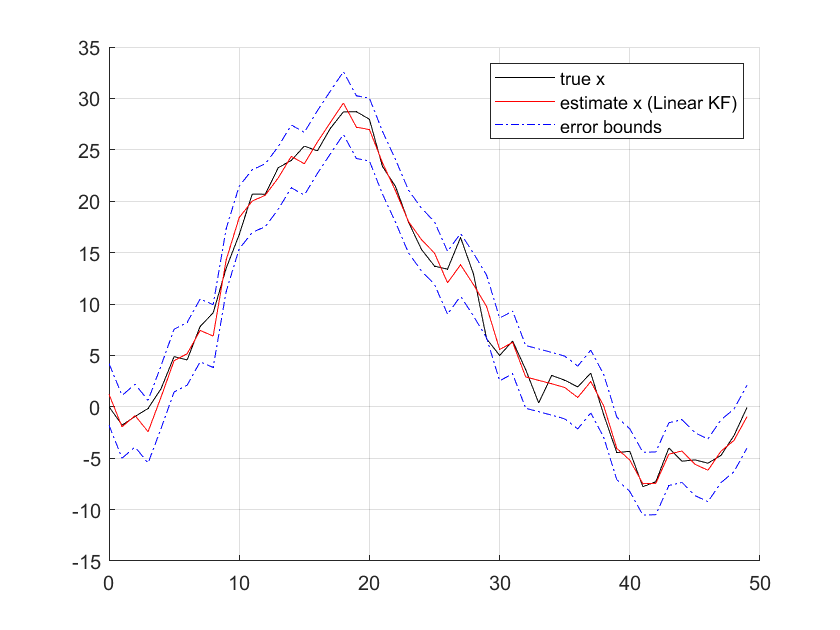

# Linear Kalman Filter
## Part 1. Linear Kalman Filter Derivation
Kalman Filter is an estimation method that uses a series of measurments observed over time. It implements minimum mean square error that minimize the difference between the true state and state estimate:


Z is the series of measurements. Thus, given all the measurement, we want to find an estimate of the state to minimize the mean square error.
Setting the derivative to 0, the optimal state estimation can be obtained: 


### Deriving Optimal Estimate
First, define the prediction error and solve for the state estimation:


Since, all densities are assumed to be Gaussian, we can find the mean of the conditional PDF of estimation error and measurement to obtain the expected value:


The mean of the conditional pdf and kalman gain L is: 


### Prediction and Correction
Thus, we have the equations required to obtain the optimal estimation: (Prediction + Correction)

#### Prediction 


#### Correction


### Applying to an Arbitrary System:
Now, let's apply the Kalman Filter to an arbitrary system A=1, B=1, C=2, D=0 with process and measurement noise random variance 5. 
```Matlab
Sig_w = 5; %Process Noise
Sig_v = 5; %Sensor Noise
A = 1; B = 1; C = 2; D = 0; % Simple State-Space Model
```
Also, arbitrarily define the input (deterministic)
```Matlab
u = sin(k/(2*pi))+randn/3;
```
The real state is unknown and we estimate the state using the Kalman Filter derived from above. The figure below shows the comparison between the real state and estimated state:
<p align="center">
  
</p>

## Part 2. Steady State Kalman Filter (Infinite Horizon)
It is possible for the Kalman Filter recursion to converge to a unique steady state solution when the system is non-time varying, {A,C} observable, and {A,Process noise variance} controllerable. 

### Hamiltonian Approach. 
If we define our state prediction variance to be:


We can derive the following relationship:


Perform the diagonal transformation of the Hamiltonian Matrix and define Y:


If the equation is from k steps after time zero and assuming k is arbitrarily high number,


Using the steady-state approach, the kalman gain and the state variance are not a function of step k. It is computationally simple with a slight penalty on optimality. The comparison between estimated state and real state is shown in the figure below (if we compare with the Linear KF approach above, the result is almost the same even if we used the constant Kalman gain:

<p align="center">
  
</p>

